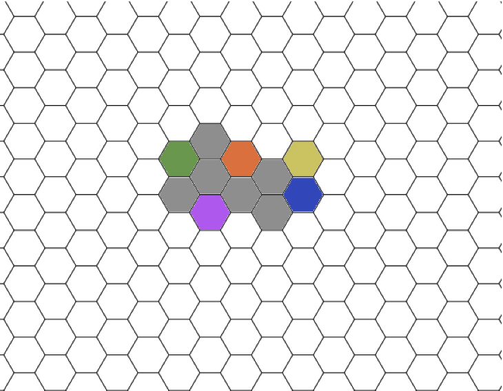
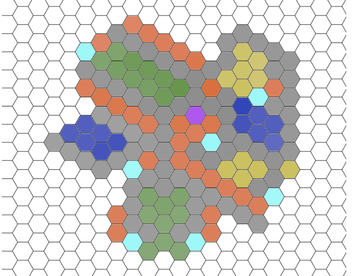

#Pioneers game design

##Primary Objective

Pioneers is a round based strategy game designed to be highly simplistic but deeply strategic. The main feature is a persistent world in which all players play (although there may be a need for a set of worlds to distribute players of differing skill ranges). The game state continues even when the player is no longer in the game. While a controversial choice, it gives this game a very novel feature not often seen on the Roblox platform.

##Key Mechanics
The goal of this game is to build the largest civilisation of all. This is not easy as the world is persistent meaning your civilisation may be attacked at any point. The larger your civilisation gets the bigger a target you are for other players. Ideally the largest civilisation is constantly changing as players battle.

The world is broken down into hexagonal tiles from which everything is based upon. The world is *not* randomly generated nor does it contain any special elements. The default map is all just a default tile so players have equivalent starting states. All progress is based purely on strategy.

The world progresses in discrete steps. Each step takes a set amount of time to progress, likely 10-20 seconds. This time forces the player to decide their turn however turns aren’t likely to require much input as most of the work is automatically carried out (eg farmers will automatically walk to a storage or home tile). These steps also decide when actions are taken, eg wood gained from forestry, military unit attacking or unit walking to another tile. This is discussed in more detail under the Units section.

A player can create different tiles to form their civilisation. These tiles are Keep, Path, House, Farm, Mine, Forestry, Barracks, Wall, Gate and Storage. These tiles can be placed anywhere but give certain bonuses or have specific restrictions depending on the tiles surrounding. For example a player may only have one keep and this keep determines if their civilisation is destroyed not. When a players keep is destroyed they have lost. All tiles must be adjacent to a path. Farms, mines, orestries and storage all get efficiency bonuses from being adjacent to their own tiles. This is discussed in more detail under the Tiles section.

As all civilisations exist within the same world they progress even when the owner is offline. This means players continues to accumulate resources and progress during time away from the game. This also means their civilisation may be attacked while they are away too. This is discussed further under the intended strategies section.

##Units
There are only two main types of unit, villagers and soldiers. 

- Villagers can be assigned to work but are unable to fight. 
- Soldiers are unable to work but will fight other units or attack tiles. 
  
This divide is to promote players to construct large numbers of houses and soldier units in order to attack instead of repurposing a lot of villagers. This also promotes the use of soldiers to idly protect the civilisation. 

Soldiers do not require rest breaks. Villagers are only able to walk on paths or through gates however soldiers are able to on grass tiles in order to reach other civilisations. Villagers can automatically walk to any path-connected tile but soldiers can only move to an adjacent tile.

##Tiles

!!! success ""
    ###Grass
    This is the default tile and indicates nothing is currently placed. This is the only tiles that can be built on top of.

!!! edit ""
    ###Keep

    This is the foundation of the civilisation. Players can choose where to place their keep however they cannot place it too close to another civilisation. When a player places a keep they are also able to immediately place 6 paths followed by 1 house, 1 farm, 1 forestry and 1 mine. Keeps cannot be constructed normally.

!!! quote ""
    ###Path

    Designated area to allow units to walk. Connects all the parts of a civilisation together however paths cannot be built too far away from any houses to prevent potential abuse. 

!!! warning ""
    ###House

    Creates a villager instantly when placed and another after a set number of turns, possibly around 20 turns. This creation of villagers is dependant on there being enough food within the civilisation and the house being within a 10 tile walk of a storage tile. 

!!! question ""
    ###Farm/Mine/Forestry

    Generates 1 food/stone/wood respectively every turn a villager is working on one of these tiles. If they are adjacent to another tile of the same type (ie two farms are next to each other) then they generate 1 extra resource for every adjacent tile. 

!!! tip ""
    ###Storage

    Holds resources. Collected resources need to be stored in one of these tiles in order for them to be usable. Collected resources are shared across all storage tiles to prevent over complicating gameplay. The keep counts as a storage tile.

!!! bug ""
    ###Barracks

    Converts a villager to a soldier after a given number of turns training. Only one villager may train at this tile at a time. 

!!! example ""
    ###Wall/Gate

    A high health tile which prevents soldiers from breaching into the civilisation. They are expensive to make and give nothing back for removing. Gates are the same as a wall except cost more and require a soldier present at all times in exchange for allowing friendly units to pass through.

##Resources
There are only 3 resources which are food, stone and wood. Food is required by villagers every time they take a rest (they grab food from the nearest storage tile and then return home). Stone and wood are used in varying amounts to construct all tiles. 

##Intended Strategies
Ideally players will strategically plan out the placement of their tiles in order to optimise the efficiency of their civilisation. A well planned civilisation would be capable of outperforming a significantly larger civilisation. This should take the form of large blocks of farm/mine/forestry tiles with storage and house tiles close by for efficient walking of workers. 

Walls are expensive so should be carefully planned before placing. No resources are returned upon their removal. Due to this it is likely players will wall in their civilisation and only expand when they can afford to protect their expansion either with walls or with soldiers. This will create tiered civilisations where larger ones get even harder and harder to fully destroy. 

When a storage tile is destroyed a percentage (likely 10-20%) of the held resources are given to the destroying player. This encourages players to go and try hunt storage tiles. Due to this new players will be given a protection period where they cannot be attacked. This period is likely to last a set number of turns until players are generally expected to be able to defend themselves or until they construct a barracks.

##Anti abuse measures
Due to the world being persistent and shared some measures must be taken in order to prevent abuse. 

If a civilisation has not been visited by the player for over 1-7 days (depending on size) then it will be automatically destroyed. This will prevent the world becoming full of empty civilisations.

Soldiers will automatically start to return to the keep if they have not been given any actions for 10 turns. This prevents soldiers from being left around the map which could stop new civilisations being created. This also means any attack must be planned and executed on the spot instead of soldiers being left to accumulate near a civilisation. Larger groups of soldiers become harder and harder to manage.

Tiles must be connected by paths and paths can only extend a set distance from near houses. This prevents civilisations growing artificially which could prevent new civilisations being made.

A civilisation can only be attacked by one player at a time with a cool down time. This prevents players colluding and ruining the experience for others. 

##Example civilisation progression

!!! info "An initial civilisation when the player first starts playing"
    
    Purple = Keep
    Grey = Path
    Green = Farm
    Orange = House
    Yellowish = Forestry
    Blue = Mine

!!! success "A typical expansion after the first 10-20 minutes of gameplay"
    
     Cyan = Storage

!!! success "Further development expected to be reached at around 30-40 minutes of gameplay"
    

    Typical high level structures start to show

!!! success "Civilisation now large enough to require barracks and walls for protection"
    
    Black = Wall
    Pink = Gate
    Red = Barracks

!!! warning "A poorly planned expansion beyond the walls"
    
    This area uses the tiles in a poorly optimised way which is hard to correct.

!!! success "A more carefully planned expansion"
    
    This demonstrates how hard it is to plan safe expansions. This expansion would be incredibly costly to try execute and incredibly difficult without true planning. Walls require paths to make them (as villagers can only walk on paths) however paths require houses near and houses require storage near. This means the expansion has to either be tiny or storage tiles will not be protected by walls for a while.

##Monetisation
As this is more of an experiment money is not the primary focus of this game and monetisation will not be heavily pushed. This game is meant to be competitive so any method of monetisation that would give any kind of competitive advantage will not be implemented.

!!! success ""
    ####Cosmetics
    
    As always players could pay to have their units or tiles look a different theme. They could even pay a large sum to have their own custom model implemented into the game just for their own civilisation! Free content which players pay to have in the game!

!!! danger ""
    ####Third party alerts/status
    
    Discussed in future improvements this feature could be monetised. It could be argued that this provides an advantage however it is not a direct advantage and would be fairly priced so the majority of players could afford it.

!!! warning ""
    ####Clans
    
    Clans would have to pay a subscription which scales to their size/ability.

##Future improvements

!!! success ""
    ####Unit Training
    
    There could be training giving to improve units abilities, for example you could train a villager to be better at farming or train soldiers to use bows or spears however this is beyond the scope of the original game.

!!! success ""
    ####Tile Upgrades
    
    Tiles could be upgraded allowing them to be improved or provide different functionality. 

!!! success ""
    ####Technology
    
    New tiles or units could be unlocked via researching technology.

!!! tip ""
    ####Competitive
    
    Either a closed world where only certain highly rated players can play or private matches where players could fight 1 on 1, many player free for all or team based games. These matches could have different values for round timing, tile/costs etc to make them either faster or slower paced. This could even allow for an elo based matchmaking system!

!!! danger ""
    ####Alerts
    
    Via the use of 3rd party platforms such as discord, players could be notified when their civilisation is under attack and react quickly. This could potentially greatly improve user retention as they are alerted about the game state and are likely to play to try defend their civilisation.

!!! quote ""
    ####Website
    
    A website could provide users with a simple overview of the entire map and possibly even the status of their own civilisation. Maybe this could even migrate off Roblox entirely? 

!!! info ""
    ####Clans
    
    Allow players to join a clan. These clans can compete against each-other on stats/leaderboards. If a clan declares they are at war with another then multiple clan members can attack a civilisation of another clan at the same time. This could lead to some incredibly intense battles. 
